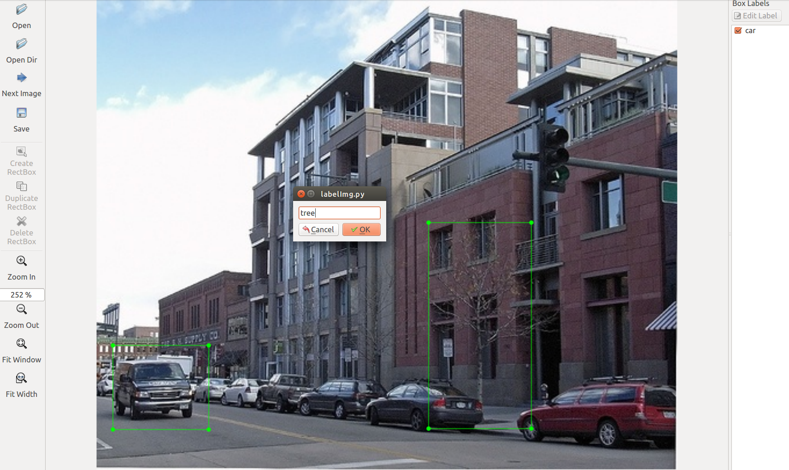

# ImageNet-Utils
Utils to help download images, crop bounding box, GUI tool to annotate image in XML file etc.

### Requirements
If you would like to download the original images, you should signup [ImageNet](http://www.image-net.org/)

### Usage - Download images:
Get the urls of wnid and download all of them. E.g., download [Dog images from ImageNet](http://www.image-net.org/synset?wnid=n02084071) and save images to ./n02084071/url_images/*.jpg

`$ ./downloadutils.py --downloadImages --wnid n02084071`

Download all original images. E.g., download the original images about [person](http://www.image-net.org/synset?wnid=n00007846) and save to ./n00007846/n00007846_original_images/*.JPEG

`$ ./downloadutils.py --downloadOriginalImages --wnid n00007846`

Download the boundingbox xml of wnid. E.g., download  bounding boxes of original images about [person](http://www.image-net.org/synset?wnid=n00007846)

`$ ./downloadutils.py --downloadBoundingBox --wnid n00007846`

### Usage - Label images into text files:
Utils to create train.txt, val.txt, and test.txt

Format: [FilePath] [id]

Use the bellow cmd, and you can get image path and its label in train.txt and test.txt

`$ ./labelcreator.py --size_of_train 1400 --size_of_test 200  --label 11 --dir ./car`

Auto assign a label to each folder containing images under the dir. Create train.txt, val.txt, and test.txt. Size is 1200, 300, and 300

`$ ./labelcreator.py --size_of_train 1200 --size_of_val 300 --size_of_test 300`

### Usage - Crop the image by annotation XML:
Search the specified image according to its boudingbox's xml, so-called annotation file. If found, it will crop and save as ./boundingbox/*.JPEG

`$ ./bbox_helper.py --save_boundingbox --bxmlpath n00007846/Annotation/n00007846/n00007846_23985.xml `

Output:

    ./n00007846/n00007846_original_images/n00007846_23985.JPEG

    [[227, 25, 323, 91]]
    save to n00007846/bounding_box_imgs/n00007846_23985_box1.JPEG

Specify a directory and crop the images according its annotation file

`$ ./bbox_helper.py --save_boundingbox --bxmldir n00007846/`

Output:

    ./n00007846/n00007846_original_images/n00007846_35737.JPEG
    [[46, 99, 165, 290]]
    save to n00007846/bounding_box_imgs/n00007846_35737_box1.JPEG
    ./n00007846/n00007846_original_images/n00007846_132010.JPEG
    [[101, 57, 330, 497]]
    save to n00007846/bounding_box_imgs/n00007846_132010_box1.JPEG
    ./n00007846/n00007846_original_images/n00007846_158081.JPEG
    [[55, 85, 249, 498]]
    .....

### Usage - Use a GUI tool to create a annotation XML:

`$ git submodule init`

`$ git submodule update --recursive`

`$ cd labelImgGUI`

`$ make all`

`$ ./labelImg.py`

More Info:
 [labelImg](https://github.com/tzutalin/labelImg)

 [Video demo](https://www.youtube.com/watch?v=p0nR2YsCY_U)

